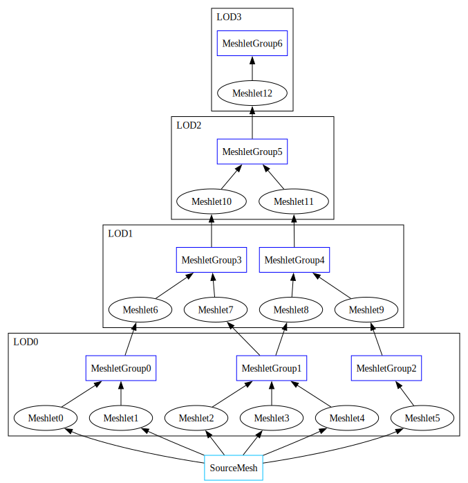

## Mesh level of detail
This library provides functionality for generating discrete and continuous levels of detail for triangle meshes using an edge collapsing mesh decimation algorithm. Main features:
- Robust handling of non manifold meshes.
- Vertex placement optimization post edge collapse.
- Support for vertex attributes and attribute discontinuities.
- Accurate estimation of introduced error using quadric error metric.
- Seamless decimation of multiple geometries.


## How to use
### Common inputs
Geometries are defined by a 32 bit index buffer and a variable stride vertex buffer. Vertices are represented by arrays of 32 bit floats where the first three floats are the vertex position and all remaining floats are vertex attributes. The maximum number of attributes per vertex is defined by `VGT_MAX_ATTRIBUTE_STRIDE_DWORDS`. See [compile time configuration](##compile-time-configuration) for more details.
```
struct Vertex {
    float position_x, position_y, position_z;
    float texcoord_u, texcoord_v;
    float normal_x, normal_y, normal_z;
};

VgtTriangleGeometryDesc geometry_descs[1] = {};
geometry_descs[0].indices      = triangle_mesh.indices.data();
geometry_descs[0].index_count  = triangle_mesh.indices.size();
geometry_descs[0].vertices     = (float*)triangle_mesh.vertices.data();
geometry_descs[0].vertex_count = triangle_mesh.vertices.size();
```
LOD build algorithms take an array of geometries as an input. All geometries of a mesh are decimated together which results in no seams at higher LODs.
```
VgtTriangleMeshDesc mesh_desc = {};
mesh_desc.geometry_descs      = geometry_descs;
mesh_desc.geometry_desc_count = 1;
mesh_desc.vertex_stride_bytes = sizeof(Vertex); // Vertices in all geometries must have the same layout.
mesh_desc.attribute_weights   = NULL;
mesh_desc.normalize_vertex_attributes = NULL;
```
Optional attribute weights can be specified to control attribute error importance relative to geometric error. Default weights==1.0 work well for vertex normals, UV coordinates, colors, etc.
```
float attribute_weights[VGT_MAX_ATTRIBUTE_STRIDE_DWORDS] = {};
attribute_weights[0] = uv_weight;
attribute_weights[1] = uv_weight;
attribute_weights[2] = normal_weight;
attribute_weights[3] = normal_weight;
attribute_weights[4] = normal_weight;

mesh_desc.attribute_weights = attribute_weights;
```


Optional vertex normalization callback can be specified to normalize unit vectors, clamp texture coordinates or colors on newly computed sets of attributes.
```
static void NormalizeVertexAttributes(float* attributes) { // Only attributes are passed to the callback.
    auto& vertex_attributes = *(VertexAttributes*)attributes;
    vertex_attributes.normal = NormalizeVector3(vertex_attributes.normal);
}

mesh_desc.normalize_vertex_attributes = &NormalizeVertexAttributes;
```

### Continuous level of detail
Continuous levels of detail build requires you to specify the maximum number of triangles and vertices per meshlet. Meshlets are the unit of mesh rendering and LOD swapping. For decimation meshlets are combined into groups of `VGT_MESHLET_GROUP_SIZE`.
```
VgtVirtualGeometryBuildInputs inputs = {};
inputs.mesh                          = mesh_desc;
inputs.meshlet_target_vertex_count   = 128;
inputs.meshlet_target_triangle_count = 128;

VgtVirtualGeometryBuildResult result = {};
VgtBuildVirtualGeometry(&inputs, &result, &callbacks);

...

VgtFreeVirtualGeometryBuildResult(&result, &callbacks);
```

### Discrete level of detail
Discrete levels of detail build requires you to specify target number of faces as well as maximum allowed decimation error for each level of detail. Note that each level of detail is built from the previous one.
```
VgtLevelOfDetailTargetDesc level_of_detail_descs[1] = {};
level_of_detail_descs[0].target_face_count  = (triangle_mesh.indices.size() / 3) / 2; // Decimate to half the number of faces.
level_of_detail_descs[0].target_error_limit = FLT_MAX; // Allow any error.

VgtMeshDecimationInputs inputs = {};
inputs.mesh                  = mesh_desc;
inputs.level_of_detail_descs = level_of_detail_descs;
inputs.level_of_detail_count = 1;

VgtMeshDecimationResult result = {};
VgtDecimateMesh(&inputs, &result, &callbacks);

...

VgtFreeMeshDecimationResult(&result, &callbacks);
```
### Memory allocation
By default all memory is allocated via C `realloc`. This behavior can be overridden by providing a custom `realloc` callbacks for temporary and/or heap allocations.
```
VgtSystemCallbacks callbacks = {};
```
Temporary allocator is used for most internal data structures. Library guarantees that allocations are freed in reverse order. This allows temporary allocator to be implemented as a stack.
```
callbacks.temp_allocator.realloc   = &CustomTempAllocatorCallback;
callbacks.temp_allocator.user_data = &custom_temp_allocator;
```
Heap allocator is used for all output arrays as well as some internal data structures. Allocations might be freed in any order.
```
callbacks.heap_allocator.realloc   = &CustomHeapAllocatorCallback;
callbacks.heap_allocator.user_data = &custom_heap_allocator;
```

## Continuous level of detail overview
> This is a high level overview of most important concepts. For an in depth discussion about virtual geometry refer to [[Brian Karis, Rune Stubbe, Graham Wihlidal. 2021. Nanite A Deep Dive.]](https://advances.realtimerendering.com/s2021/Karis_Nanite_SIGGRAPH_Advances_2021_final.pdf).

Continuous level of detail is represented by a hierarchy of meshlets and meshlet groups:



### Meshlets
Meshlets are small sets of adjacent triangles that serve as the unit of LOD swapping. Each meshlet has a current and coarser level of detail groups. For example meshlet 6 is built from triangles of meshlet group 0 (current level of detail) and is part of meshlet group 3 (coarser level of detail). For convenience meshlets store both current and coarser level of detail group indices as well as their error metrics. Meshlet LOD culling requires evaluation of both error metrics:
```
bool should_render_meshlet =
    (EvaluateErrorMetric(meshlet.current_level_error_metric) <= target_error) && // Current LOD meshlet error is small enough.
    (EvaluateErrorMetric(meshlet.coarser_level_error_metric) >  target_error).   // Coarser LOD meshlet error is too high.
```

### Meshlet groups
Meshlet groups are sets of adjacent meshlets that server as the unit of mesh decimation. They are built from meshlets, decimated, and then split back into meshlets. For example meshlet group 1 is built from meshlets 2, 3, 4 and split into meshlets 7, 8. Meshlet groups store a union of source meshlet errors, as well as group's own decimation error. This makes the error function monotonically increasing as you get closer to the last LOD. For example error for meshlet group 4 is computed as:
 ```
 meshlet_group_4.error_metric = ErrorMetricUnion(
    meshlet_group_4_decimation_error,
    meshlet_8.current_level_error_metric,
    meshlet_9.current_level_error_metric
);
 ```

### How to render
Assuming that you already have a working meshlet based geometry rendering pipeline in your engine, adding a basic support for continuous level of detail requires you to:
- Use the vertex, index, and meshlet triangle buffers from `VgtMeshDecimationResult` to build your runtime mesh representation. Note that vertex buffer might contain new vertices. For more details refer to [`MeshDecimation.h`](MeshDecimation.h).
- Store current and coarser level of detail error metrics per meshlet.
- Evaluate error metrics and perform level of detail culling in your meshlet culling shader.

A more advanced implementation might store and evaluate `coarser_level_error_metric` per meshlet group or hierarchically to reduce the number meshlets considered and rejected during culling. 


## Compile time configuration
The library has a small set of configurations that are performance sensitive and have to be done using global definitions. There are two ways to set them:
- Globally define `VGT_CONFIGURATION_FILE="Path/To/VgtConfigurationFile.h"` in your build system and add individual definitions to the configuration file.
- Globally set each definition in your build system.

### Vertex attribute count limit
Default vertex attribute count limit is set to 16. If you have more or less attributes per vertex, you can set a custom limit using `VGT_MAX_ATTRIBUTE_STRIDE_DWORDS`. For example:
```
// Default attribute count limit is set to 16.
#define VGT_MAX_ATTRIBUTE_STRIDE_DWORDS 16
```
### Meshlet group size
Meshlet groups size used for virtual geometry construction is defined by `VGT_MESHLET_GROUP_SIZE`. Larger group sizes result in higher quality decimation at the cost of less granular LOD swapping at runtime.
```
#define VGT_MESHLET_GROUP_SIZE 32
```


## Third Party
Uses [meshoptimizer](https://github.com/zeux/meshoptimizer). Copyright (c) 2016-2025, Arseny Kapoulkine. Available under MIT license. See full license text in [THIRD_PARTY_LICENSES.md](https://github.com/Georgy-Khachatryan/MeshDecimation/blob/master/THIRD_PARTY_LICENSES.md)
- Meshlet generation algorithm is based on the implementation from meshoptimizer.
- Some internal data structures and utility functions are based on meshoptimizer code. Check references to [Kapoulkine 2025] for more detail.
