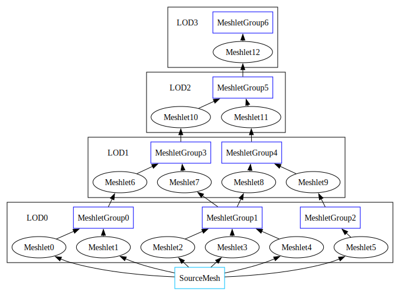

## Mesh level of detail
Level of detail techniques are essential for managing geometric complexity of large scenes. The fundamental idea is based on how samples are distributed under perspective projection: the sampling frequency in screen space is constant, but the corresponding frequency in world space varies with distance to the camera. As a result, farther objects are sampled at a much lower spatial frequency. Level of detail techniques take advantage of this by reducing geometric complexity of distant objects. This results in both decreased rendering cost and memory savings.

This library provides functionality for generating discrete and continuous levels of detail for triangle meshes.

### Continuous level of detail
Continuous levels of detail are based on a [precomputed hierarchy](#continuous-level-of-detail-overview) of meshlets and meshlet groups. At runtime the hierarchy is used to find a view dependent subset of meshlets that can potentially span multiple LODs. This fine grained LOD swapping opens a way to stream mesh data on per meshlet group basis.


### Discrete level of detail
Discrete level of detail build generates a set of independent meshes with decreasing number of triangles on each level. At rendering time appropriate level of detail can be selected using distance or projected error as a metric. Discrete nature of LOD swapping necessitates per LOD streaming.

### Mesh decimation
 A custom implementation of edge collapsing mesh decimation algorithm is used for LOD generation. Notable features:
- Robust handling of non manifold meshes.
- Support for vertex attributes and attribute discontinuities.
- Seamless decimation of meshes consisting of multiple geometries (or materials).
- Vertex placement optimization post edge collapse.
- Accurate estimation of introduced error using quadric error metric.


## How to use
### Common inputs
Geometries are defined by a 32 bit index buffer and a variable stride vertex buffer. Vertices are represented by arrays of 32 bit floats where the first three floats are the vertex position while remaining floats are vertex attributes. The maximum number of attributes per vertex is defined by `MDT_MAX_ATTRIBUTE_STRIDE_DWORDS`. See [compile time configuration](#compile-time-configuration) for more details.
```
struct Vertex {
    // The first three floats are interpreted as the vertex position.
    float position_x, position_y, position_z;

    // All of the remaining floats are interpreted as vertex attributes.
    float texcoord_u, texcoord_v;
    float normal_x, normal_y, normal_z;
};

MdtTriangleGeometryDesc geometry_descs[1] = {};
geometry_descs[0].indices      = triangle_mesh.indices.data();
geometry_descs[0].index_count  = triangle_mesh.indices.size();
geometry_descs[0].vertices     = (float*)triangle_mesh.vertices.data();
geometry_descs[0].vertex_count = triangle_mesh.vertices.size();
```
Multiple geometries can be passed to the LOD build algorithms. All geometries of a single mesh are decimated together which results in no seams at higher LODs at the geometric boundaries.
```
MdtTriangleMeshDesc mesh_desc = {}; // Default initialize to zero (zero is a safe default for all optional settings).
mesh_desc.geometry_descs      = geometry_descs;
mesh_desc.geometry_desc_count = 1;
mesh_desc.vertex_stride_bytes = sizeof(Vertex); // Vertices in all geometries must have the same layout.
```
Optional position and attribute weights can be specified on the mesh to control the balance between geometric and attribute errors, as well as overall error magnitude. Recommended position weight range is [0.25, 1.0], default value of geometric_weight==0.5 gives a good balance between quality and reported decimation error. Default attribute weights==1.0 work well for vertex normals, UV coordinates, colors, etc.
```
float attribute_weights[MDT_MAX_ATTRIBUTE_STRIDE_DWORDS] = {};
attribute_weights[0] = uv_weight;
attribute_weights[1] = uv_weight;
attribute_weights[2] = normal_weight;
attribute_weights[3] = normal_weight;
attribute_weights[4] = normal_weight;

mesh_desc.geometric_weight  = 0.5f;
mesh_desc.attribute_weights = attribute_weights;
```
Optional vertex normalization callback can be specified to normalize unit vectors, clamp texture coordinates or colors on newly computed sets of attributes.
```
static void NormalizeVertexAttributes(float* attributes) { // Only attributes are passed to the callback.
    auto& vertex_attributes = *(VertexAttributes*)attributes;
    vertex_attributes.normal = NormalizeVector3(vertex_attributes.normal);
}

mesh_desc.normalize_vertex_attributes = &NormalizeVertexAttributes;
```

### Continuous level of detail
Continuous levels of detail are based on meshlets and meshlet groups. Meshlets are small sets of spatially and topologically adjacent triangles of a single geometry. The maximum number of triangles and vertices per meshlet is specified on the build inputs, while absolute limits are `MDT_MAX_MESHLET_VERTEX_COUNT=254` and `MDT_MAX_MESHLET_FACE_COUNT=128`. For decimation meshlets are combined into groups of `MDT_MESHLET_GROUP_SIZE`.
```
MdtContinuousLodBuildInputs inputs = {};
inputs.mesh                          = mesh_desc;
inputs.meshlet_target_vertex_count   = 128; // Optimal maximum vertex and triangle counts are hardware dependent.
inputs.meshlet_target_triangle_count = 128;

MdtContinuousLodBuildResult result = {};
MdtBuildContinuousLod(&inputs, &result, &callbacks);

...

MdtFreeContinuousLodBuildResult(&result, &callbacks);
```

### Discrete level of detail
Discrete levels of detail build algorithm sequentially decimates the input mesh. Target face count and error limits are specified per level of detail.
```
MdtLevelOfDetailTargetDesc level_of_detail_descs[1] = {};
level_of_detail_descs[0].target_face_count  = (triangle_mesh.indices.size() / 3) / 2; // Decimate to half the number of faces.
level_of_detail_descs[0].target_error_limit = FLT_MAX; // Allow any error.

MdtDiscreteLodBuildInputs inputs = {};
inputs.mesh                  = mesh_desc;
inputs.level_of_detail_descs = level_of_detail_descs;
inputs.level_of_detail_count = 1;

MdtDiscreteLodBuildResult result = {};
MdtBuildDiscreteLod(&inputs, &result, &callbacks);

...

MdtFreeDiscreteLodBuildResult(&result, &callbacks);
```

### Memory allocation
By default all memory is allocated via C `realloc`. This behavior can be overridden by providing custom `realloc` callbacks for temporary and/or heap allocators.
```
MdtSystemCallbacks callbacks = {};
```
Temporary allocator is used for most internal data structures. Library guarantees that allocations are freed in reverse order. This allows temporary allocator to be implemented as a stack.
```
callbacks.temp_allocator.realloc   = &CustomTempAllocatorCallback;
callbacks.temp_allocator.user_data = &custom_temp_allocator;
```
Heap allocator is used for all output arrays as well as some internal data structures. Allocations might be freed in any order.
```
callbacks.heap_allocator.realloc   = &CustomHeapAllocatorCallback;
callbacks.heap_allocator.user_data = &custom_heap_allocator;
```

## Continuous level of detail overview
> This is a high level overview of the most important concepts. For an in depth discussion about virtual geometry refer to [[Brian Karis, Rune Stubbe, Graham Wihlidal. 2021. Nanite A Deep Dive.]](https://advances.realtimerendering.com/s2021/Karis_Nanite_SIGGRAPH_Advances_2021_final.pdf).

Continuous level of detail is represented by a hierarchy of meshlets and meshlet groups:



### Meshlets
Meshlets are small sets of adjacent triangles that serve as the unit of LOD swapping. Each meshlet has a current and a coarser level of detail group. For example meshlet 6 is built from triangles of meshlet group 0 (current level of detail 0) and is a part of meshlet group 3 (coarser level of detail 1). For convenience meshlets store both current and coarser level of detail group indices as well as their error metrics. Meshlet LOD culling requires evaluation of both error metrics:
```
bool should_render_meshlet =
    (EvaluateErrorMetric(meshlet.current_level_error_metric) <= target_error) && // Current LOD meshlet error is small enough.
    (EvaluateErrorMetric(meshlet.coarser_level_error_metric) >  target_error).   // Coarser LOD meshlet error is too high.
```
To simplify runtime material binning and rendering code, meshlets contain triangles of only a single geometry.

### Meshlet groups
Meshlet groups are sets of adjacent meshlets that serve as the unit of mesh decimation. They are built from meshlets, decimated, and then split back into meshlets. For example meshlet group 1 is built from meshlets 2, 3, 4 and split into meshlets 7, 8. Meshlet groups store a union of source meshlet errors, as well as group's own decimation error. This makes the error function monotonically increasing as you get closer to the last LOD. For example tbe error for meshlet group 4 is computed as:
 ```
 meshlet_group_4.error_metric = ErrorMetricUnion(
    meshlet_group_4_decimation_error,
    meshlet_8.current_level_error_metric,
    meshlet_9.current_level_error_metric
);
 ```
To allow mesh decimation across geometry boundaries, meshlet groups may be built from meshlets of different geometries.

### How to render
Assuming that you already have a working meshlet based geometry rendering pipeline in your engine, adding a basic support for continuous level of detail requires you to:
- Use the vertex, index, and meshlet triangle buffers from `MdtMeshDecimationResult` to build your runtime mesh representation. Note that vertex buffer might contain new vertices. For more details refer to [`MeshDecimationTools.h`](MeshDecimationTools.h).
- Store current and coarser level of detail error metrics per meshlet.
- Evaluate error metrics and perform level of detail culling in your meshlet culling shader. [`MeshDecimationToolsErrorMetric.hlsl`](MeshDecimationToolsErrorMetric.hlsl) contains an example shader code for error metric evaluation.

A more advanced implementation might store and evaluate `coarser_level_error_metric` per meshlet group or hierarchically to reduce the number meshlets considered but rejected during culling.


## Compile time configuration
The library has a small set of configurations that are performance sensitive and are done using global definitions. There are two ways to set them:
- Globally define `MDT_CONFIGURATION_FILE="Path/To/MdtConfigurationFile.h"` in your build system and add individual definitions to the configuration file.
- Globally set each definition in your build system.

### Vertex attribute count limit
Default vertex attribute count limit is set to 16. If you have more or less attributes per vertex, you can set a custom limit using `MDT_MAX_ATTRIBUTE_STRIDE_DWORDS`. For example:
```
// Default attribute count limit is set to 16.
#define MDT_MAX_ATTRIBUTE_STRIDE_DWORDS 16
```

### Meshlet group size
Meshlet groups size used for continuous level of detail construction is defined by `MDT_MESHLET_GROUP_SIZE`. Larger group sizes result in higher quality decimation at the cost of less granular LOD swapping at runtime.
```
#define MDT_MESHLET_GROUP_SIZE 32
```

### Assertion handler
By default asserts are handled via C `assert`. You can set a custom assertion handler by defining `MDT_ASSERT` macro.
```
#define MDT_ASSERT(condition) assert(condition)
```

## Limitations and further work
- Performance. Mesh decimation algorithm is significantly slower than it could be. Most of the time is spent computing and recomputing edge collapse errors (on average around 50 edge collapse errors are recomputed after each performed edge collapse). This results in poor throughput of around 67k triangles/s for DLOD build and 87k triangles/s for CLOD build on Ryzen 9 9950x. Threading can significantly speed up CLOD build times, but there are opportunities for improving single threaded performance too.
- Meshlet generation quality. Overall meshlet generation quality at lower LODs is relatively good, but at higher LODs meshlets might have enclaves of other meshlets. The same is true for meshlet group generation. As a workaround you can set `meshlet_min_face_count` and `meshlet_group_min_meshlet_count` to 1.
- Mesh decimation quality improvements. Volume preservation quadrics. Higher quality quadric minimization. Virtual edge insertion. Per meshlet group error scaling.
- Transient memory usage. There is a large amount of transient allocations which may not be necessary.
- Lack of mesh skinning support.


## References
This library is inspired by and based on 2021 Siggraph talk by Brian Karis about Nanite Virtual Geometry:
- Brian Karis, Rune Stubbe, Graham Wihlidal. 2021. Nanite A Deep Dive.

Mesh Decimation References:
- Michael Garland, Paul S. Heckbert. 1997. Surface Simplification Using Quadric Error Metrics.
- Hugues Hoppe. 1999. New Quadric Metric for Simplifying Meshes with Appearance Attributes.
- Hugues Hoppe, Steve Marschner. 2000. Efficient Minimization of New Quadric Metric for Simplifying Meshes with Appearance Attributes.
- HSUEH-TI DEREK LIU, XIAOTING ZHANG, CEM YUKSEL. 2024. Simplifying Triangle Meshes in the Wild.

Other References:
- Thomas Wang. 1997. Integer Hash Function.
- Matthias Teschner, Bruno Heidelberger, Matthias Muller, Danat Pomeranets, Markus Gross. 2003. Optimized Spatial Hashing for Collision Detection of Deformable Objects.
- Arseny Kapoulkine. 2025. Meshoptimizer library.

## Third Party
Uses [meshoptimizer](https://github.com/zeux/meshoptimizer). Copyright (c) 2016-2025, Arseny Kapoulkine. Available under MIT license. See full license text in [THIRD_PARTY_LICENSES.md](THIRD_PARTY_LICENSES.md)
- Meshlet generation algorithm is based on the implementation from meshoptimizer.
- Some internal data structures and utility functions are based on meshoptimizer code. Check references to [Kapoulkine 2025] for more details.
